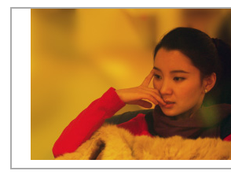
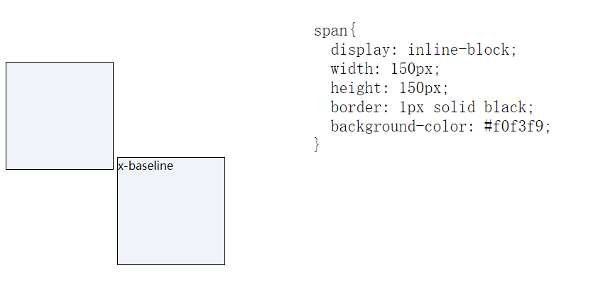

# CSS世界

## 5.2 内联元素的基石 line-height


## vertical-align
图片垂直居中`display:inline-block`和`display:table-cell`处理方式不同;
```html
<style>
  div{
    display:inline-block;
    width:400px;
    height:400px;
    /* 仅仅这样是不够的，由于虚拟空白节点的存在，高度太小 */
    line-height:400px;
    /* 我这才理解了 为什么说 inline-block 的高度是由line-height完全决定的 */
  }
  img{
    vertical-align:middle;
  }
</style>

<!-- 或者下面 table-cell 的方式 -->
<style>
  div{
    display:table-cell;
    width:400px;
    height:400px;
    vertical-align:middle;
  }
</style>
<div>
  
</div>
```

+ line-height引出的问题：
```html
<style>
  span{
    font-size:24px;
  }
</style>

<div>
  x<span>字符x</span>
</div>
<!-- 对字符而言 font-size越大字符的极限位置越往下，因为文字默认全部都是基线对齐，所以当自豪不一样的两个文字在一起的时候，彼此就会发生上下位移，如果位移距离足够大，会超出行高的限制，导致高度变化 -->
```

+ 图片空隙问题：

  ```html
  <style>
    div{
      border:1px solid black;
      text-align:center;
      width:300px;
    }
  </style>
  <div>
    
  </div>
  ```
  解决方案：
  (1) 图片块状化。可以一口气干掉“幽灵空白节点”、line-height 和 verticalalign。
  (2) 容器 line-height 足够小。只要半行间距小到字母 x 的下边缘位置或者再往上，自然就没有了撑开底部间隙高度空间了。比方说，容器设置 line-height:0。
  (3) 容器 font-size 足够小。此方法要想生效，需要容器的 line-height 属性值和当前 font-size 相关，如 line-height:1.5 或者 line-height:150%之类；否则只会让下面的间隙变得更大，因为基线位置因字符 x 变小而往上升了。
  (4) 图片设置其他 vertical-align 属性值。间隙的产生原因之一就是基线对齐，所以我们设置 vertical-align 的值为 top、 middle、bottom 中的任意一个都是可以的。
   
+ 内联特性导致margin失效：
  首先，非主动触发的内联元素是无法跑到容器外部，举个例子：
  ```html
    <style>
      div{
        border:1px solid black;
      }
      img{
        margin-top:-200px;
      }
    </style>

    <div>
      
    </div>
  ```
  200px已经超过图片自身高度，但是图片不会跑到容器外面，就算设置成99999px也不会继续往上移动，完全失效。依然是幽灵空白节点的原因，非主动触发位移的内联元素是不可能跑到计算容器外面的，导致图片的位置被“幽灵空白节点”的 vertical-align:baseline 给限死了。

### 5.3.4 深入理解vertical-align 线性类属性值
  1.inline-block与baseline
  一个 inline-block 元素，如果里面没有内联元素，或者 overflow 不是 visible，则该元素的基线就是其 margin 底边缘；否则其基线就是元素里面最后一行内联元素的基线。
  当我们给图二设置了line-height:0后，内联元素高度变为0了，高度起始位置变成了垂直中心位置，所以会露出去一般文字，然后由于文字露出，字符跟着上移，基线也会上移所以落差会越来越大。


## 流的破坏与保护

### 6.1.1 float的本质与特性
  float属性设计的目的是为了实现文字环绕效果。

  当你手中只有一把锤子的时候，你往往会把一切问题都看成钉子。浮动属性来布局非常符合现实世界的认识，什么是认识呢？就是搭积木或者说垒砖头砌墙，反映在代码实现上就是把元素一个一个顶宽定高，通过浮动一个一个堆积起来，理论上一个float:left声明几乎就可以把整个页面结构都弄出来，而且内联元素的间隙问题，margin合并问题都没有。

  + 高度塌陷不是bug是标准。

  + 无依赖绝对定位：我们把没有设置left/top/right/bottom属性值的绝对定位称为"无依赖绝对定位"。 很多场景下，因为其除了代码更简洁外，还有一个很棒的特性，就是"相对定位特性"。 

  我们可以利用其特性做比如 左上角右上角的热卖等效果，右下角的返回顶部
  图片居中等效果（利用幽灵空白节点）

  + overflow 和 absolute 元素裁剪的规则，用一句话表述就是：绝对定位元素不总是被父级overflow属性裁剪，尤其当overflow在绝对定位元素及其包含块之间的时候。
  =
  如果overflow不是定位元素，同时绝对定位元素和overflow容器之间也没有定位元素，则overflow无法对absolute元素进行剪裁。

  + 最佳可访问性隐藏：
  指的是虽然肉眼看不见，但是其他辅助设备却能够进行识别和访问的隐藏。举个例子，很多网站左上角都有包含自己网站名称的标识，而这些标识一般都是图片，为了更好地SEO以及无障碍识别，我们一般会使用<h1>标签写上网站的名称
  ```html
  <a href="/" class="logo">
    <h1>CSS 世界</h1>
  </a>
  ```
  如何隐藏<h1>标签中的“CSS 世界”这几个文字，通常有以下一些技术选型。
  • 下策是 display:none 或者 visibility:hidden 隐藏，因为屏幕阅读设备会忽略这里的文字。
  • text-indent 缩进是中策，但文字如果缩进过大，大到屏幕之外，屏幕阅读设备也是不会读取的。
  • color:transparent 是移动端上策，但却是桌面端中策，因为原生 IE8 浏览器并不支持它。 color:transparent 声明，很难用简单的方式阻止文本被框选。
  • clip 剪裁隐藏是上策，既满足视觉上的隐藏，屏幕阅读设备等辅助设备也支持得很好。
  ```css
  .logo h1 {
    position: absolute;
    clip: rect(0 0 0 0);
  }
  ```
  clip 剪裁被我称为“最佳可访问性隐藏”的另外一个原因就是，它具有更强的普遍适应性，任何元素、任何场景都可以无障碍使用。例如，我定义一个如下的 CSS 语句块：
  ``` css
  .clip {
    position: absolute;
    clip: rect(0 0 0 0);
  }
  ```
  就可以整站使用，哪里需要“可访问性隐藏”就加一个类名.clip 即可，无论是图片、文字还是块级元素，都可以满足隐藏需求（与文字透明、缩进等方法相比）。同时， clip 语法简单，功能单一，与其他 CSS 属性相比，和元素原本 CSS 样式冲突的概率更低。

  + 表单提交submit

    众所周知，如果<form>表单元素里面有一个 type 为 submit 或者 image 类型的按钮，那么表单自动有回车提交行为，可以节约大量啰嗦的键盘相关的事件的代码。但是，submit 类型按钮在IE7下有黑框，很难所有浏览器（包括Firefox在内的浏览器） UI 完全一致，对视觉呈现是个一挑战。于是就有了使用<label>元素李代桃僵的经典策略

    • display:none 或者 visibility:hidden 隐藏有两个问题，一个是按钮无法被focus 了，另外一个是 IE8 浏览器下提交行为丢失，原因应该与按钮 focus 特性丢失有关。
    • 透明度 0 覆盖也是一个不错的实践。如果是移动端项目，建议这么做；但如果是桌面端项目，则完全没有必要。使用透明度 0 覆盖的问题是每一个场景都需要根据环境的不同重新定位，以保证点击区域的准确性，成本较高，但 clip 隐藏直接用一个类名加一下就好。
    • 还有一种比较具有适用性的“可访问隐藏”是下面这种屏幕外隐藏：
    ``` css
    .abs-out {
      position: absolute;
      left: -999px; top: -999px;
    }
    ``` 
    然而， 会出现一个比较麻烦的问题。 当一个控件元素被 focus的时候，浏览器会自动改变滚动高度，让这个控件元素在屏幕内显示。假如说我们的<label>“提交”按钮在第二屏，则点击按钮的时候浏览器会自动跳到第一屏置顶，因为按钮隐藏在了屏幕外，于是发生了非常糟糕的体验问题。而 clip 就地剪裁，就不会有“页面跳动”的体验问题。于是，权衡成本和效果， clip 隐藏成为了最佳选择，特别是对于桌面端项目。

    + absolute的流体特性
      一个元素如果我们只设置了 absolute 不设置top/left/right/bottom 这些属性的话, 元素是具有相对特性，如果单一设置了某一个方向的属性，只是这个方向具有流体特性,比如：
      ```html
      <div class="box"></div>
      <style>
        .box{
          position:absolute;
          left:0;
          right:0;
        }
      </style>
      ```
      如果只有left属性或者只有right属性，则由于包裹性，此时.box宽度是0。但是在本例中，因为left和right同时存在，所以宽度不是0，而是表现为"格式化宽度"，宽度自适应于.box包含快的padding box，也就是说，如果包含块的padding box 宽度发生变化，.box的宽度也会跟着一起变化。 

      绝对定位元素的margin：auto的填充规则和普通流体元素的一模一样。
      百分比transform会让ios微信闪退，还是尽量避免的好。


### relative与定位
  relative的定位有两大特性：一是相对自身，二是无侵入。

  相对定位百分比值是相对于包含快计算的，而不是自身。
  四个属性同时作用的时候，绝对定位是尺寸拉伸，保持流体特性，但相对定位却是'你死我活'的表现，也就是说，只有一个方向的定位属性会起作用，top>bottom,left>right。

  + relative的最小化影响原则
  （1）尽量不使用relative，如果想定位某些元素，看看能否使用"无依赖的绝对定位"；
  （2）如果场景受限，一定要使用relative，则该relative务必最小化。


## 7层叠上下文和层叠水平

层叠上下文：英文称作stacking context，是HTML中的一个三维的概念。如果一个元素有层叠上下文，我们理解为这个元素在z轴上就高人一等。

层叠水平，决定了同一个层叠上下文中元素在z轴上的显示顺序。