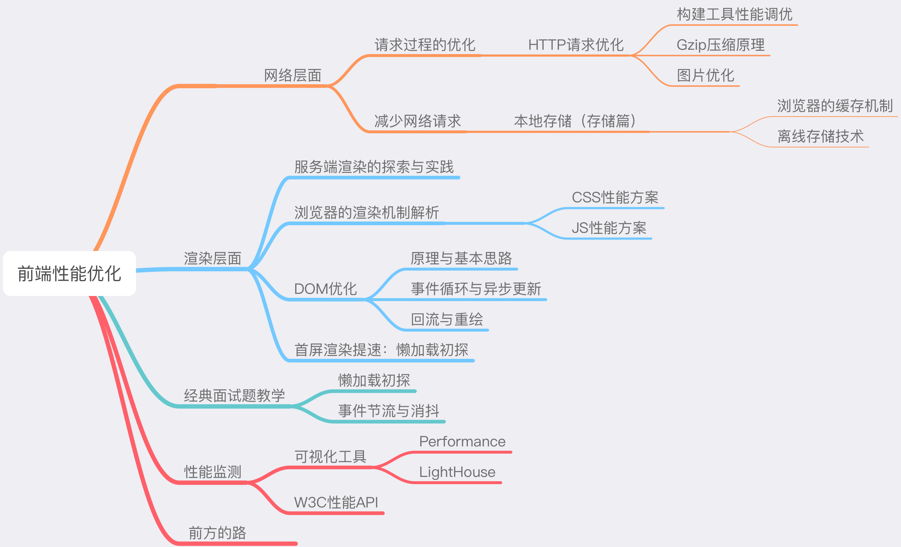
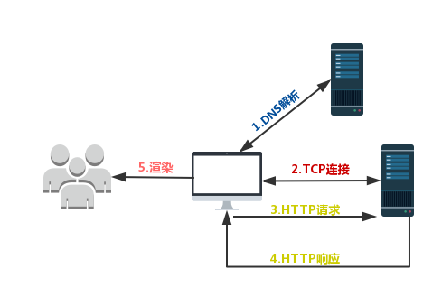

# 前端性能优化 

性能优化具体框架图：

## 楔子
从一到面试题说起：从输入URL到页面加载完成，发生了什么？

我们现在站在性能优化的角度，一起简单地复习一遍这个经典的过程：首先我们需要通过 DNS（域名解析系统）将 URL 解析为对应的 IP 地址，然后与这个 IP 地址确定的那台服务器建立起 TCP 网络连接，随后我们向服务端抛出我们的 HTTP 请求，服务端处理完我们的请求之后，把目标数据放在 HTTP 响应里返回给客户端，拿到响应数据的浏览器就可以开始走一个渲染的流程。渲染完毕，页面便呈现给了用户，并时刻等待响应用户的操作（如下图所示）。

### webpack 性能调优
我们从输入 URL 到显示页面这个过程中，涉及到网络层面的，有三个主要过程
+ DNS 解析
+ TCP 连接
+ HTTP请求/响应

对于DNS解析和TCP连接我们能做的非常有限，相比之下，HTTP连接这一层面的优化是我们网络优化的核心。
HTTP 优化有两个大的方向：

+ 减少请求次数
+ 减少单词请求所花费的时间

这两个优化点直指我们日常开发中非常常见的操作 ---- 资源的压缩与合并。没错，这就是我们每天用构建工再做的事情。

#### webpack性能瓶颈

